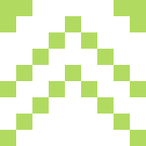
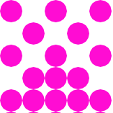
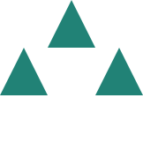

# Ginger

Ginger is a simpple identicon generator for Golang

Inspired by Github identicon

## Installation

```shell
go get github.com/HungTP-Play/ginger-go
```

## Usage

### Import

```go
import 
(
   gingerbuilder "github.com/HungTP-Play/ginger-go/module/builder"
)
```

### Create an identicon

Use **BuildIdenticon** fuction to create a **Identicon** structure

**BuilIdenticon** has 4 params:

- input []byte: identity information (you can use email, user_id or uuid)
- size model.Size: 3x3, 5x5, 7x7, 9x9
- imgSize int: output image size in pixel
- symmetry bool: output symmetry
- threshold int: byte >= thredhold will be select to color, otherwise will have a background color (white)

```go
identicon := gingerbuilder.BuildIdenticon([]byte(email), model.Size5x5, 250, false, 128)
```

### Draw Identicon to file

Use **DrawIdenticon** from drawing to draw the identicon to file (currently, it only draw to an PNG)

**DrawIdenticon** has 3 params:

- identicon Identicon
- outputDirPath output directory path, image name will be \<identity_information\>.png
- spriteType enum

```go
drawing.DrawIdenticon(identicon, "output", drawing.Circle)
```

### Example

- Square Type
   
- Circle Type
  
- Triangle Type
  
- Rhombus Type
  
